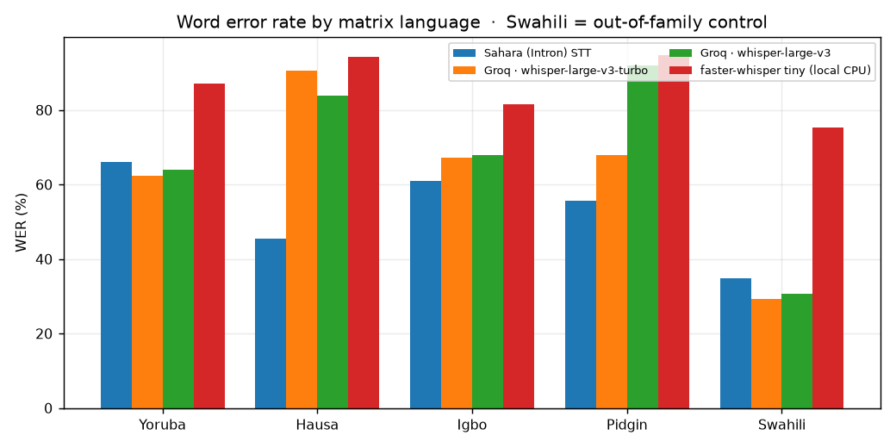
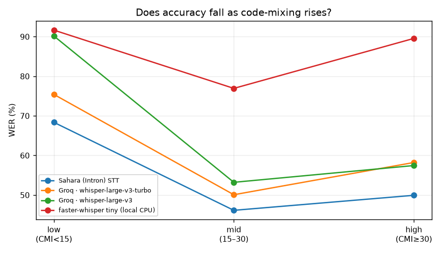
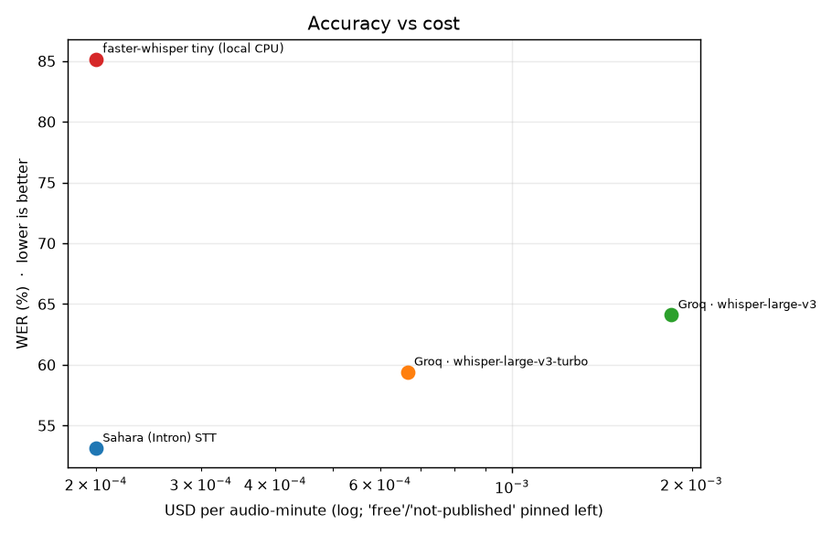
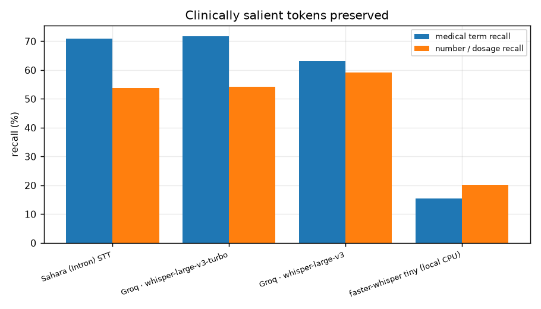

# Kare · code-switching ASR benchmark

*Generated by `python -m benchmark.report` from `results/`. Ran
2026-09-11 13:17 UTC on 3.12.14 / macOS-13.4-x86_64-i386-64bit.*

**What this measures.** Nigerian patients do not speak one language at a time.
They say *"the doctor talk say my BP dey high"* — Yoruba/Pidgin grammar with
English clinical terms dropped in. Kare's voice layer has to get **both** the
matrix language **and** the embedded English right, because the English words
are usually the clinically load-bearing ones (drug names, "blood pressure",
"twice daily"). Standard ASR leaderboards are monolingual and miss this
entirely, so we built our own.

**Data.** 20 conversations
(128.5 min) from **Intron's AfriSwitchCare** — simulated
doctor–patient consultations, English code-switched with Yoruba, Hausa, Igbo
and Nigerian Pidgin, plus **Swahili as an out-of-family control** (a language
none of Kare's users speak; it shows whether a model has learned West-African
speech or merely memorised it). The exact clips are frozen in
[`frozen_manifest.jsonl`](../frozen_manifest.jsonl) (seed 20260915).

**Lowest word error rate on this set: Sahara (Intron) STT.** But cost, latency and clinical-term recall pull in different directions — full picture below.

## Headline numbers

| Model | WER | WER (norm) | CER | Med-term recall | Number recall | CMI err | Switch err | RTF | $/audio-min |
|---|--:|--:|--:|--:|--:|--:|--:|--:|--:|
| Sahara (Intron) STT | 53.1 | 52.6 | 41.0 | 71.0 | 53.7 | 4.4 | 84.8 | 0.15 | n/p |
| Groq · whisper-large-v3-turbo | 59.4 | 58.9 | 39.9 | 71.8 | 54.2 | 6.5 | 63.4 | 0.13 | $0.0007 |
| Groq · whisper-large-v3 | 64.1 | 63.7 | 43.1 | 63.1 | 59.3 | 7.6 | 71.8 | 0.05 | $0.0019 |
| faster-whisper tiny (local CPU) | 85.2 | 85.0 | 67.8 | 15.5 | 20.2 | 7.4 | 121.8 | 0.41 | $0.0000 |

- **WER** — light normalisation (lower-case, punctuation & speaker tags removed).
- **WER (norm)** — additionally spells out digits and unifies a few spelling
  variants; the gap to plain WER is formatting, not mis-hearing.
- **Med-term / Number recall** — of the medical terms (resp. spoken numbers &
  dosages) in the reference, the fraction that survive into the transcript.
  This is the metric that matters most clinically.
- **CMI err** — absolute error in the Code-Mixing Index between reference and
  hypothesis (same English-dictionary estimator on both sides, so its bias
  cancels). **Switch err** — mean error in the count of language-switch points.
- **RTF** — real-time factor, wall-clock ÷ audio. <1 is faster than real time.

## By language

| Model | Yoruba | Hausa | Igbo | Pidgin | Swahili | Nigerian avg | Swahili Δ |
|---|--:|--:|--:|--:|--:|--:|--:|
| Sahara (Intron) STT | 66.1 | 45.5 | 61.0 | 55.7 | 34.9 | 57.1 | -22.2 |
| Groq · whisper-large-v3-turbo | 62.3 | 90.6 | 67.3 | 67.9 | 29.3 | 72.0 | -42.7 |
| Groq · whisper-large-v3 | 63.9 | 83.9 | 67.8 | 91.9 | 30.5 | 76.9 | -46.3 |
| faster-whisper tiny (local CPU) | 87.2 | 94.2 | 81.6 | 94.7 | 75.3 | 89.4 | -14.2 |

*"Swahili Δ" is Swahili WER minus the mean of the four Nigerian languages. A
large positive Δ means the model leans on West-African-specific training and
generalises poorly; a small Δ means it is broadly multilingual.*

## Accuracy vs code-mixing intensity

| Model | low CMI (<15) | mid (15–30) | high (≥30) | high − low |
|---|--:|--:|--:|--:|
| Sahara (Intron) STT | 68.4 | 46.1 | 49.9 | -18.4 |
| Groq · whisper-large-v3-turbo | 75.4 | 50.1 | 58.2 | -17.2 |
| Groq · whisper-large-v3 | 90.2 | 53.2 | 57.4 | -32.7 |
| faster-whisper tiny (local CPU) | 91.7 | 76.9 | 89.6 | -2.1 |

If a model's "high − low" is strongly positive, dense code-switching breaks it —
exactly the utterances Kare sees most. A flat line is what we want.

## Cost and speed

| Model | audio min | wall-clock min | RTF | run cost | notes |
|---|--:|--:|--:|--:|---|
| Sahara (Intron) STT | 128.5 | 19.3 | 0.15 | — | clinical model; per-minute price not published |
| Groq · whisper-large-v3-turbo | 128.5 | 16.3 | 0.13 | $0.09 | fastest hosted option |
| Groq · whisper-large-v3 | 128.5 | 6.4 | 0.05 | $0.24 | free tier rate-limited; price shown is paid tier |
| faster-whisper tiny (local CPU) | 128.5 | 52.3 | 0.41 | — | runs on a CPU laptop, no network |

## Clinically salient tokens

A transcript can have a respectable WER and still drop the one word that
matters. Med-term and number recall isolate that: they only score tokens like
*insulin*, *39 degrees*, *twice daily*, *no fever*.

## Transcript samples

First ~45 words of one conversation per language, all models. `[[EN]]…[[/EN]]` spans in the reference mark the human code-switch annotation (stripped in the excerpt); the English words are what a clinician needs.

### Yoruba — Acute Appendicitis (gold CMI 21.85)

**Reference** · okay good morning good morning doctor okay what is your name elijah samuel okay how old are you i am 28 okay so kí ló gbé ẹ wà sì hospital lónìí i came to complain about abdominal pain okay how long have you been having …

- **Sahara (Intron) STT** (WER 64, keyterm 43) · ok google monidon ok samuel ok op so kilogbe was see hospital i get to complain because abominal pain ok how long long even have been disabled in happening okay ṣé ọkọ di bẹ́ẹ̀ ni a be ok so can if describe this pain àti …
- **Groq · whisper-large-v3-turbo** (WER 49, keyterm 80) · okay good morning good morning doctor okay what's your name elijah samuel okay how old are you i'm 28 okay so do you like to be able to see your speech later i came to complain about abdominal pain okay how long ago have you …
- **Groq · whisper-large-v3** (WER 44, keyterm 70) · ok good morning good morning doctor ok what's your name elijah samuel ok how old are you i'm 28 ok so what are you doing at the hospital i came to complain about abominable pain ok how long have you been having this abominable pain …
- **faster-whisper tiny (local CPU)** (WER 88, keyterm 3) · okay good morning good morning doctor okay good morning good morning doctor okay who are you okay okay so what do you want to do okay so what do you want to do okay how long have you been able to do this 4 years …

### Hausa — Acute Appendicitis (gold CMI 28.46)

**Reference** · gaisuwa sir miye sunanka sunana abdul kai dan shekara nawa ne shekara na 28 me ya kawo ka zuwa asibitin mu wallahi ciwon ciki nakeji ya kai kwana nawa yakai kwana hudu okay ciwon ciki din ina kana ji ciwo din ehh yafara mundai daga …

- **Sahara (Intron) STT** (WER 51, keyterm 67) · gaisuwa sir ciwon ciki nake ji ya kai kwana nayi kwana hudu ok ciwon cikin ina kana ji ciwo din ya fara mun ne daga saman ciki na ne sannan kuma sai ya sauko ta hannun dama na ok ciwon ciki is it gradual ko …
- **Groq · whisper-large-v3-turbo** (WER 96, keyterm 22) · sousa a mee su nanka su nana abdi kait dan shakarana anee chikarana ashirin datakos meey a kao ka zua abso biti mo chivoan chiki nne kei echi ya kei kwa na na na na ya kei kwa na ulu okay um chivo chikin dan …
- **Groq · whisper-large-v3** (WER 81, keyterm 11) · gei suwa sa me sunanka sunana abdi kaj dan shakara nani shakara na asherin datakos me ya kawa kazuwa hawasi bitimu chivo nchikin ekeji ya ke kwanana ya ke kwanana kudu oke am chivo chikinden ina kanaji chivo den ya paramundi daga samun chiki nani …
- **faster-whisper tiny (local CPU)** (WER 95, keyterm 0) · gesewa sa mey sunanka sunara abdu kaik da nishakara anani unki karanahashira nuda tapas meyakao ka zua havesubitun kaik da nishakara anana kaik da nishakara anana kaik da nishakara anana kaik da nishakara anana kaik da nishakara anana kana sikaba pendants ko naga nea zua …

### Igbo — Asthma (gold CMI 39.43)

**Reference** · ndewo ma o ndewo doctor good evening good evening olee etụ ịdị adi m mma ok welcome to our hospital thank you ọ gịnị mere iji bịa taa doctor ọ kwa ụkwara ụkwara ok before we get there afa olee ka ịdị adi m 27 …

- **Sahara (Intron) STT** (WER 60, keyterm 73) · ndewo mawo ndewo dọ́kị́tà adị m mma nke welcome to our hospital thank you ji bịa taa dọkịta ọkwa ụkwara ụkwara before we get there after 27 years gịnị ka ị na arụ ugbu a ahụ krista ha n'igbo na ndị ọzọ ọ nwanne child …
- **Groq · whisper-large-v3-turbo** (WER 78, keyterm 40) · okay welcome to our hospital thank you before we get there um how far we could do i did 27 years okay okay okay okay video oh one day two days ago okay okay does it come very frequently no okay is it better during …
- **Groq · whisper-large-v3** (WER 77, keyterm 67) · good evening doctor good evening welcome to our hospital thank you again you need to be at her doctor okwara ok before we get there how old were you 27 years okay okay okay so oh one day two days ago okay when did you …
- **faster-whisper tiny (local CPU)** (WER 88, keyterm 27) · there were a mouth where are the doctors where did you leave did you leave me let me leave thank you okay welcome to our hospital thank you thank you thank you good morning doctor who are who are you who are you okay before …

### Pidgin — Acute Appendicitis (gold CMI 0.53)

**Reference** · good afternoon how are you doing i'm dr okenla welcome to our clinic today what's your name sir yeah i'm ifeoluwa okay how old are you i'm 28 years okay what do you do yeah i'm a student okay are you married no not at …

- **Sahara (Intron) STT** (WER 37, keyterm 87) · good afternoon how are you doing i'm dr okenla welcome to our clinic today whats your name sir yam fivoloah ok how old are you i'm 20 years what do you do i'm a student ok are you married no not at all so what …
- **Groq · whisper-large-v3-turbo** (WER 37, keyterm 85) · good afternoon how are you doing i'm dr okila um welcome to our clinic today what's your name sir yeah i'm um okay how old are you i'm 28 years okay what do you do i'm a student okay are you married no not at …
- **Groq · whisper-large-v3** (WER 71, keyterm 37) · good afternoon how are you doing i'm dr okinla welcome to our clinic today what's your name sir yeah i'm fivoloa okay how old are you i'm 28 years what do you do i'm a student are you married no not at all so what …
- **faster-whisper tiny (local CPU)** (WER 93, keyterm 2) · hvis du er et feafstandræds på vores afgjerns du er et indfæstræs ogt jeg har ikke været prøvet som søget modføvet at sæt det er ikke simpelthen det er ikke prøvet det er ikke prøvet det er ikke prøvet hvordan smidde sæs fra det du …

### Swahili — Drug-induced Psychosis (gold CMI 45.63)

**Reference** · good morning good morning to you too how are you today i'm doing good i am dr wamutende and i will be attending to you today good to know you daktari can you tell me your name and your age mimi ni james i am …

- **Sahara (Intron) STT** (WER 40, keyterm 100) · good morning good morning toyota how are you today i'm doing good i am doctor amutende and i will be attending to you today good to know you doctor can you tell me your name and your age mimi james i am 25 years old …
- **Groq · whisper-large-v3-turbo** (WER 32, keyterm 100) · good morning good morning toyota how are you today i'm doing good i am dr wamutende and i will be attending to you today good to know you doctor can you tell me your name and your age mimi ni james i am 25 years …
- **Groq · whisper-large-v3** (WER 27, keyterm 100) · good morning good morning toyota how are you today i'm doing good i am dr wamutende and i will be attending to you today good to know you doctor can you tell me your name and your age mimi ni james i am 25 years …
- **faster-whisper tiny (local CPU)** (WER 84, keyterm 38) · good morning good morning sir how are you today i'm doing good i am dr muhtembe i will be attending to you today good do you know you talked about can you tell me your name and your age my name is nidims i am …

## Harness notes

- **Segmentation.** Every conversation is cut into ≤110 s windows before
  transcription (Sahara's sync endpoint and Whisper's file limits both sit
  around there). The *same* slices go to every model, and hypotheses are
  concatenated back before scoring against the full reference. Boundary
  word-splits add perhaps 0.5–1 WER point uniformly across models.
- **Language hint.** Each model is given its native language code where it has
  one (`yo`, `ha`, `ig`, `sw`); Pidgin has no ISO code so Whisper models
  auto-detect and Sahara gets `pcm`.
- **Retries.** 429/5xx are retried with backoff, so rate limits slow a run
  rather than failing it. Segments are cached — a re-run only fills gaps.
- **Reproduce.** `make benchmark` (or `python -m benchmark.subset &&
  python -m benchmark.run && python -m benchmark.report`). Raw audio is not
  committed; the manifest + `HF_TOKEN` reconstructs it.

## Fairness & limitations

- AfriSwitchCare is **simulated** consultations read by voice artists, not
  real clinic audio — cleaner acoustics, less crosstalk and background noise
  than Kare will meet in the field. Absolute WERs here are a **floor**.
- 20 conversations in the frozen subset (80 segments) —
  enough to rank models, not enough for tight per-language confidence
  intervals. Treat sub-language differences under ~3 points as noise.
- The English-word detector behind the CMI / switch metrics is a dictionary
  lookup; it mislabels proper nouns and loanwords. It is applied identically
  to every model, so comparisons are fair, but the absolute CMI error has a
  systematic offset.
- Two of Kare's languages (Igbo, Hausa) have the least training data across
  every model — the benchmark makes that gap visible rather than hiding it.
