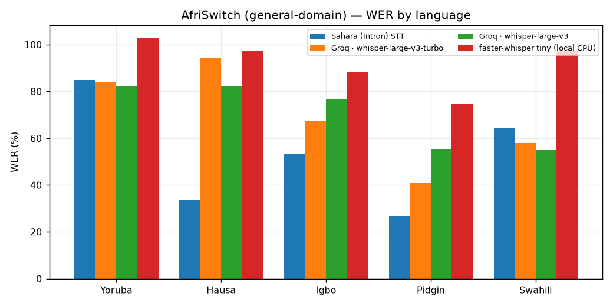

# Kare · generalisation check — AfriSwitch (non-clinical)

AfriSwitchCare is clinical-domain and is the primary benchmark (`../report/REPORT.md`). This is the same 4 STT models run on **AfriSwitch** — 125 short, general-domain utterances across the same 5 languages, no clinical script, sampled from a separate manual-gated corpus. It answers one question the clinical report can't: **does a model's edge on scripted clinical consultations hold on ordinary speech, or was it specific to that domain?**

## Headline numbers (AfriSwitch)

| Model | WER | WER (norm) | CER | Med-term recall | Number recall | CMI err | Switch err | RTF | $/audio-min |
|---|--:|--:|--:|--:|--:|--:|--:|--:|--:|
| Sahara (Intron) STT | 51.8 | 51.6 | 32.4 | 33.3 | 42.1 | 7.8 | 3.3 | 0.92 | n/p |
| Groq · whisper-large-v3-turbo | 67.9 | 68.1 | 37.2 | 66.7 | 32.0 | 8.4 | 3.5 | 0.39 | $0.0007 |
| Groq · whisper-large-v3 | 68.7 | 68.5 | 35.9 | 33.3 | 34.9 | 9.2 | 4.0 | 0.39 | $0.0019 |
| faster-whisper tiny (local CPU) | 92.2 | 92.6 | 62.9 | 0.0 | 14.3 | 14.3 | 5.7 | 1.32 | $0.0000 |

## By language

| Model | Yoruba | Hausa | Igbo | Pidgin | Swahili | Nigerian avg | Swahili Δ |
|---|--:|--:|--:|--:|--:|--:|--:|
| Sahara (Intron) STT | 84.7 | 33.7 | 53.1 | 26.9 | 64.5 | 49.6 | +14.9 |
| Groq · whisper-large-v3-turbo | 84.0 | 94.2 | 67.2 | 40.8 | 58.0 | 71.5 | -13.5 |
| Groq · whisper-large-v3 | 82.2 | 82.3 | 76.5 | 55.1 | 54.9 | 74.0 | -19.1 |
| faster-whisper tiny (local CPU) | 103.0 | 97.3 | 88.4 | 74.7 | 97.1 | 90.9 | +6.3 |

## Generalisation: clinical vs. general-domain

A small or negative Δ means the model's clinical-set accuracy was not a fluke of that script — it holds on ordinary speech too. A large positive Δ means the model (or the harness) was in some way fitted to the clinical domain.

| Model | WER · clinical (AfriSwitchCare) | WER · general (AfriSwitch) | Δ (general − clinical) |
|---|--:|--:|--:|
| Sahara (Intron) STT | 53.1 | 51.8 | -1.4 |
| Groq · whisper-large-v3-turbo | 59.4 | 67.9 | +8.5 |
| Groq · whisper-large-v3 | 64.1 | 68.7 | +4.5 |
| faster-whisper tiny (local CPU) | 85.2 | 92.2 | +7.0 |

## Caveats
- AfriSwitch utterances are much shorter than AfriSwitchCare's conversations (seconds, not minutes) and are not health-domain, so medical-term/number recall is less meaningful here — read the WER columns as the primary signal.
- Only shard 0 of each language's parquet was fetched (thousands of utterances) rather than the full corpus; the frozen subset is a stratified sample of that shard — see `frozen_manifest_switch.jsonl`.
- Reproduce: `make bench-data-switch bench-subset-switch bench-run-switch bench-report-switch` (needs manual-approved access to `intronhealth/AfriSwitch` + `HF_TOKEN`).
